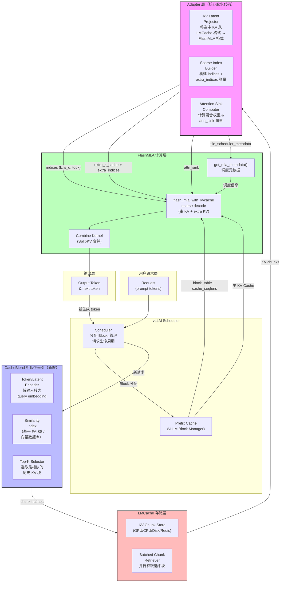
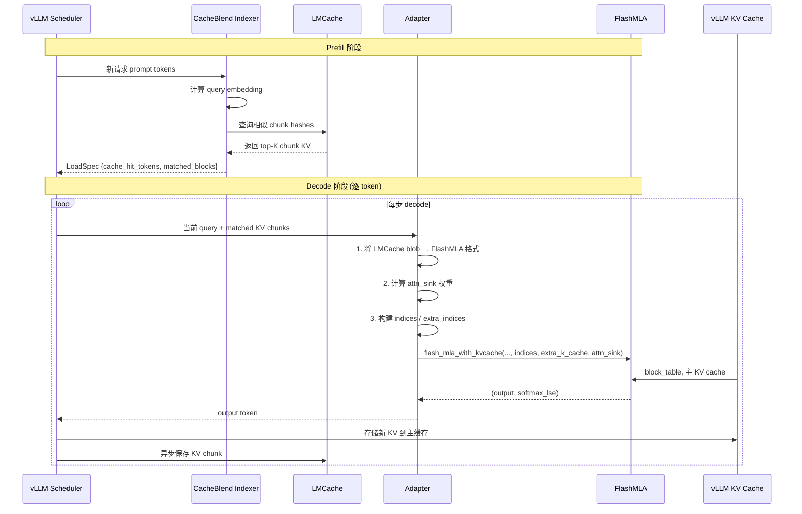
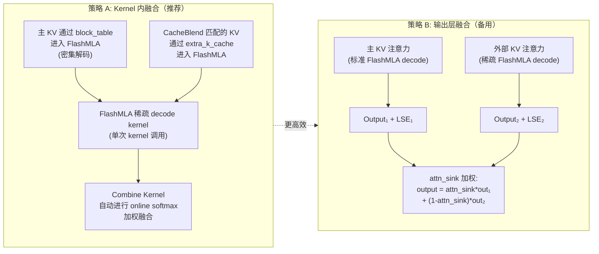

# MLA 算子级深度融合方案：CacheBlend + ShadowKV

> **用途**：分析将 CacheBlend 的选择性重算、ShadowKV 的 CPU 内存卸载与 MLA 注意力算子进行**算子级融合**的技术可行性。
>
> **核心思路修正 (2026-05)**：此前方案仅在 Python 层将 MLA 压缩与 CacheBlend 逻辑简单拼接（相加），两者在硬件上工作区不同，未真正融合。本方案改为**修改 MLA 的 CUDA 算子**，在一个 kernel 内同时处理三路数据源：GPU 缓存命中、选择性重算、CPU 卸载冷数据。
>
> **已完成实验**：纯 CacheBlend vs MLA+CacheBlend 基础对比（399 样本，88.8% 显存节省）。详见 [`../reports/report_400.pdf`](../reports/report_400.pdf)。

---

## 目录

1. [三个项目的核心接口分析](#1-三个项目的核心接口分析)
2. [接口对比：直接连接点 vs. 胶水代码需求](#2-接口对比直接连接点-vs-胶水代码需求)
3. [系统架构与数据流图](#3-系统架构与数据流图)
4. [适配器模块伪代码](#4-适配器模块伪代码)
5. [三大技术风险](#5-三大技术风险)
6. [消融实验设计方案](#6-消融实验设计方案)

---

## 0. 问题修正：为什么"相加"不是融合

### 0.1 当前方案的本质

之前的"MLA+CacheBlend"方案本质上是：

```
┌─ Python 层 ──────────────────────────────┐
│  1. MLA latent 压缩（kv_a_proj → 512维）   │  ← HuggingFace forward hook
│  2. 缓存命中判断（token 前缀匹配）          │  ← Python 逻辑
│  3. 命中 → 读缓存 latent；未命 → 重算       │  ← Python if/else
│  4. kv_b_proj 重建完整 KV                   │  ← torch F.linear
│  5. 标准 attention                          │  ← HuggingFace 内置
└───────────────────────────────────────────┘
```

问题：
- **MLA 压缩** 和 **CacheBlend 选择** 是两个独立步骤，没有在硬件层面交织
- 缓存命中/未命中的 token 走不同的 Python 分支，无法 overlap 计算
- 重建 KV (`kv_b_proj`) 是独立的矩阵乘，然后才喂给 attention kernel——两次 kernel launch，两次 HBM 读写
- 完全没有 CPU 卸载能力，冷数据只能丢弃或占 GPU 显存

### 0.2 真正的融合应该是什么

**三路数据源，一个 kernel：**

```
┌─ 修改后的 MLA CUDA Kernel ─────────────────────────────────────┐
│                                                                 │
│  对每个 query token q_i，同时处理三路 KV 源：                    │
│                                                                 │
│  ┌─ 路径 A: GPU 缓存命中 ──────────────────────┐                │
│  │  读取缓存的 latent (512B) + k_pe (128B)     │  ← HBM 顺序读  │
│  │  在 kernel 内直接做 kv_b_proj (fused)        │  ← 不出 kernel  │
│  │  与 q_i 做点积 → score_A                     │                │
│  └──────────────────────────────────────────────┘                │
│                                                                 │
│  ┌─ 路径 B: 需要重算的 token ──────────────────┐                │
│  │  从 hidden_states 实时计算 kv_a_proj         │  ← 寄存器/共享内存│
│  │  在 kernel 内完成 latent → KV 重建           │  ← fused        │
│  │  与 q_i 做点积 → score_B                     │                │
│  └──────────────────────────────────────────────┘                │
│                                                                 │
│  ┌─ 路径 C: CPU 卸载的冷数据 (ShadowKV) ──────┐                │
│  │  异步 DMA 从 CPU 内存拉取 latent             │  ← PCIe 流传输  │
│  │  double buffer：当前块计算时预取下一块        │  ← 流水线       │
│  │  与 q_i 做点积 → score_C                     │                │
│  └──────────────────────────────────────────────┘                │
│                                                                 │
│  online softmax: score = softmax([score_A; score_B; score_C])   │
│  output = score_A @ V_A + score_B @ V_B + score_C @ V_C        │
│                                                                 │
└─────────────────────────────────────────────────────────────────┘
```

关键区别：
- **一次 kernel launch**，不是三次
- **kv_b_proj 在 kernel 内部融合**（作为 epilogue 或 prologue），不产生中间 KV 张量的 HBM 读写
- **三路 KV 的 attention score 在 register level 合并**，使用 online softmax，不需要先算完再拼
- **CPU 数据通过 CUDA stream + async copy 流水线化**，与 GPU 计算 overlap

### 0.3 ShadowKV 的 CPU 卸载策略

ShadowKV 的核心思想：

```
GPU HBM（热数据）          CPU DDR（冷数据）
┌─────────────────┐       ┌─────────────────┐
│ 最近 N 个 chunk  │ ←──→ │ 更早的 chunk     │
│ 高 attention 分  │ PCIe  │ 低 attention 分  │
│ 延迟敏感         │ 64GB/s│ 延迟不敏感       │
└─────────────────┘       └─────────────────┘
```

与 MLA 融合后的分层存储：

| 层级 | 存储位置 | 内容 | 大小/token | 带宽 |
|---|---|---|---|---|
| L0 | GPU 寄存器/SMEM | 当前正在计算的 KV | 0（实时算） | ~TB/s |
| L1 | GPU HBM | 热数据 latent + k_pe | 640 B | ~3 TB/s |
| L2 | CPU DDR | 冷数据 latent + k_pe | 640 B | ~64 GB/s (PCIe 5.0) |
| L3 | NVMe/远程 | 归档数据 | 640 B | ~7 GB/s |

**MLA 压缩使得 CPU 卸载更高效**：每 token 从 4096B (full KV) 降到 640B (latent+k_pe)，PCIe 传输量减少 84.4%。

---

## 1. 三个项目的核心接口分析

### 1.1 FlashMLA

FlashMLA 是 DeepSeek 开源的 MLA 高性能 CUDA 算子库，核心函数只有一个：

```python
# flash_mla/flash_mla_interface.py:53-70

def flash_mla_with_kvcache(
    q: torch.Tensor,                    # (b, s_q, h_q, d_qk)
    k_cache: torch.Tensor,              # (num_blocks, page_block_size, h_k, d_qk)
    block_table: Optional[torch.Tensor], # (b, max_num_blocks_per_seq), int32
    cache_seqlens: Optional[torch.Tensor], # (b,), int32
    head_dim_v: int,                    # 固定为 512
    tile_scheduler_metadata: FlashMLASchedMeta,
    softmax_scale: Optional[float] = None,
    causal: bool = False,
    is_fp8_kvcache: bool = False,
    indices: Optional[torch.Tensor] = None,   # (b, s_q, topk) — 稀疏路径
    attn_sink: Optional[torch.Tensor] = None,
    extra_k_cache: Optional[torch.Tensor] = None,       # 额外 KV 块
    extra_indices_in_kvcache: Optional[torch.Tensor] = None,
    **topk_length_params
) -> Tuple[torch.Tensor, torch.Tensor]:   # (out, softmax_lse)
```

**关键设计要点**：

| 特性 | 说明 |
|---|---|
| **KV Cache 格式** | 压缩存储。DeepSeek V3.2 中每 token 仅 656 字节（512B NoPE(fp8) + 16B 缩放因子 + 128B RoPE(bf16)）。`h_k` 固定为 1（MQA 风格）。 |
| **分页机制** | 通过 `block_table` 实现逻辑-物理地址映射，`page_block_size` 通常为 64。 |
| **稀疏注意力** | `indices` 参数直接指定 K V 位置索引（非连续），支持 `extra_k_cache` 额外上下文拼接。这是 FlashMLA 原生支持的"非连续 KV 访问"能力。 |
| **密集注意力** | 使用 `block_table` + `cache_seqlens` 顺序遍历缓存块，支持 causal mask。 |
| **Split-KV** | 通过 `tile_scheduler_metadata` 实现 SM 级别的 Split-KV 调度，对用户透明。 |
| **调度元数据** | `FlashMLASchedMeta` 缓存配置信息，同一 shape 可复用。 |

**C++ 层接口**（[csrc/api/api.cpp](csrc/api/api.cpp)）暴露 5 个 CUDA kernel 入口：

```cpp
PYBIND11_MODULE(TORCH_EXTENSION_NAME, m) {
    m.def("sparse_decode_fwd", &sparse_attn_decode_interface);
    m.def("dense_decode_fwd",  &dense_attn_decode_interface);
    m.def("sparse_prefill_fwd", &sparse_attn_prefill_interface);
    m.def("dense_prefill_fwd",  &FMHACutlassSM100FwdRun);
    m.def("dense_prefill_bwd",  &FMHACutlassSM100BwdRun);
}
```

**稀疏路径的核心能力**（[csrc/api/sparse_decode.h](csrc/api/sparse_decode.h)）：
- 支持 `extra_kv` + `extra_indices`，可在主 KV 缓存之外附加一块非连续的 KV 数据。这正是 CacheBlend 融合的关键 hook。
- 支持 `attn_sink` 机制，用于在 softmax 层面混合两路注意力输出。

---

### 1.2 vLLM + CacheBlend 相关实现

**重要发现：CacheBlend 并未在 vLLM 代码库中以同名实现。** 其语义等价的功能分散在以下模块中：

#### (a) FlashMLA 后端集成（[vllm/v1/attention/backends/mla/flashmla.py](vllm/v1/attention/backends/mla/flashmla.py)）

vLLM 将 FlashMLA 封装为 `FlashMLABackend`，在 `forward_mqa()` 中调用：

```python
# flashmla.py:254-334
class FlashMLAImpl(MLACommonImpl[FlashMLAMetadata]):
    def forward_mqa(self, q, kv_c_and_k_pe_cache, attn_metadata, layer):
        o, lse = flash_mla_with_kvcache(
            q=q,
            k_cache=kv_c_and_k_pe_cache.unsqueeze(-2),  # 添加 h_k=1 维度
            block_table=attn_metadata.decode.block_table,
            cache_seqlens=attn_metadata.decode.seq_lens,
            ...
        )
```

#### (b) 稀疏 MLA 后端（[vllm/v1/attention/backends/mla/flashmla_sparse.py](vllm/v1/attention/backends/mla/flashmla_sparse.py)）

将 FlashMLA 的稀疏解码 + BF16 预填充组合使用。关键特征：
- 支持 FP8 KV Cache 的混合批处理（decode + prefill 同时进行）
- 通过 `triton_convert_req_index_to_global_index` 将请求级索引转换为 GPU 全局 slot 索引
- 支持 `compress_ratio`（DeepSeek V4 的 C128A 压缩），进一步压缩 KV cache

#### (c) LMCache 集成（[vllm/distributed/kv_transfer/kv_connector/v1/lmcache_integration/vllm_v1_adapter.py](vllm/distributed/kv_transfer/kv_connector/v1/lmcache_integration/vllm_v1_adapter.py)）

这是 vLLM 与 LMCache 的桥梁。核心流程：

```
┌─ Scheduler 侧 ───────────────────────────┐
│  get_num_new_matched_tokens()  → 查 LMCache 命中  │
│  build_connector_meta()        → 构建 LoadSpec     │
└──────────────────────────────────────────────┘
┌─ Worker 侧 ────────────────────────────────┐
│  start_load_kv()    → retrieve tokens from LMCache   │
│  save_kv_layer()    → store tokens to LMCache         │
│  wait_for_save()    → 等待存储完成                   │
└──────────────────────────────────────────────────┘
```

**MLA 特殊处理**（[utils.py](vllm/distributed/kv_transfer/kv_connector/v1/lmcache_integration/utils.py)）：
```python
# 当 use_mla=True 时，KV shape 从 (num_layer, 2, chunk_size, ...) → (num_layer, 1, chunk_size, ...)
kv_shape = (num_layer, 1 if use_mla else 2, chunk_size, num_kv_head, head_size)
```

#### (d) MLA 注意力原理（[mla_attention.py](vllm/model_executor/layers/attention/mla_attention.py)）

文档中清晰描述了 MLA 的两种计算路径：

**Compute-friendly（用于 prefill）**：展开 KV 到标准 MHA，计算全因果注意力。

**Data-movement-friendly（用于 decode）**：保持 KV 在压缩状态（latent），以 MQA 方式计算：

```
q  [Sq, N, Lkv+R]  vs  KV  [Skv, Lkv+R]   →  MQA 注意力
output  [Sq, N, Lkv]  →  einsum with W_UV  →  [Sq, N*V]  →  W_O  →  [Sq, H]
```

关键点：**MLA decode 路径在压缩空间（latent space）中计算注意力，不需要展开 KV**。

---

### 1.3 LMCache

当前仓库（`LMCache-main-deprecate`）为 v0 版本，核心接口：

```python
class LMCacheEngine:
    def store(self, tokens, kv_tensors, skip_existing=True, blocking=True):
        # 以 token hash 为 key，按 chunk_size 分块存储 KV
        # kv_tensors 格式：嵌套元组或 blob tensor
        
    def retrieve(self, tokens, device='cuda') -> Tuple[KVCache, int]:
        # 按 token 前缀匹配，返回连续的最长匹配 KV 块
        # 返回: (kv_tensors, num_matched_tokens)
```

**数据流**：

```
store():  tokens → hash(chunk) → chunk KV → storage backend (GPU/CPU/disk/Redis)
retrieve(): tokens → hash(chunk) → lookup → chunk KV → concat → return
```

**存储后端层次**：
- `LMCLocalBackend`：GPU/CPU 内存
- `LMCLocalDiskBackend`：本地磁盘
- `LMCRemoteBackend`：远程 Redis
- `LMCHybridBackend`：本地+远程分级

**关键局限**：
- 仅支持 **连续前缀匹配**（prefix caching），不支持非连续 KV 块匹配
- 不感知 MLA 的压缩格式（只是作为通用 KV blob 存储）
- vLLM 集成使用新版 LMCache v1（不在本仓库），其中包含 `LMCBlender` 的 blend 能力

---

## 2. 接口对比：直接连接点 vs. 胶水代码需求

### 2.1 可以直接连接的地方（✅）

| 连接点 | 说明 |
|---|---|
| **FlashMLA `extra_k_cache` / `extra_indices` → CacheBlend 复用块** | FlashMLA 稀疏解码原生支持附加 KV 块，这正是注入"外部复用 KV"的天然入口。 |
| **FlashMLA `attn_sink` → 注意力混合** | `attn_sink` 参数允许在 softmax 层面混合两路注意力输出，可用于 CacheBlend 的"blending"操作（通过 LSE 加权）。 |
| **vLLM `FlashMLABackend` 的套接层 → FlashMLA** | vLLM 已经完整封装了 FlashMLA 的 dense/sparse decode + prefill，适配器只需扩展 metadata 结构。 |
| **LMCache 的分块存储 → CacheBlend 的 KV 索引** | LMCache 的 chunk-based 存储天然支持"块级别"的 KV 管理，可作为 CacheBlend 相似性索引的存储层。 |
| **LMCache GPU Connector → vLLM paged buffer** | LMCache v1 的 `VLLMPagedMemGPUConnectorV2` 已经实现了将外部 KV 写入 vLLM 分页缓冲区的逻辑。 |

### 2.2 需要胶水代码的地方（🔧）

| 冲突点 | 具体问题 | 解决方案方向 |
|---|---|---|
| **CacheBlend 语义匹配在 token 空间 → FlashMLA 在 latent 空间** | CacheBlend 的核心是识别语义相似的 token 块。但 MLA 的 KV 是压缩的 latent 表示（无明确 token 级语义），无法直接做 token 级相似度匹配。 | **胶水方案**：在压缩 KV 的 latent 空间做相似度匹配。使用 KV latent 向量之间的 cosine similarity 替代 token embedding 相似度。或者：在 Q 的 latent 空间（`ql_nope`）做匹配。 |
| **CacheBlend 需要交叉注意力混合 → FlashMLA 的 MQA 结构** | CacheBlend 的核心步骤是：对每个 query，从历史 KV 中选择 top-k 相似块，以**交叉注意力**方式混合。但 FlashMLA decode kernel 固定使用 MQA（`h_k=1`），不支持每个 query 不同 KV source 的混合。 | **胶水方案 A**：使用 FlashMLA 稀疏路径，将选中的历史 KV 块通过 `extra_k_cache` 一次性注入，让 kernel 内部处理。**方案 B**：在 attention 输出层（post-softmax）做 blending，对两路输出进行加权求和。 |
| **LMCache 只做连续前缀匹配 → CacheBlend 需要非连续匹配** | LMCache 的 `retrieve()` 要求输入 token 的前缀连续匹配。CacheBlend 需要从多个不连续位置检索 KV 块。 | **胶水方案**：在 LMCache 之上封装一层 `CacheBlendIndexer`，对每个 query token 计算与历史 chunk 的相似度，返回 top-k 的 chunk hash 列表，然后通过 LMCache 的 `batched_get()` 并行获取。 |
| **FlashMLA 的 page block 对齐要求** | FlashMLA 要求 KV 缓存连续有效（"contiguously valid"），不能是碎片列表。用于 decode 的 block_table 要求块对齐。 | **胶水方案**：外部 KV 块不直接写入 FlashMLA 主 KV 缓存，而是通过 `extra_k_cache` 传入（它有自己的 page table），或通过 `attn_sink` 机制在 kernel 外部做后融合。 |
| **CacheBlend 的 softmax 重归一化 vs FlashMLA 的 online softmax** | FlashMLA kernel 内部使用 online softmax（Split-KV 方式），对 `extra_k_cache` 的 softmax 融合是 kernel 内部完成的。CacheBlend 的"weighted blending"需要访问 LSE（log-sum-exp）。 | **利用 FlashMLA 已有机制**：FlashMLA 返回 `softmax_lse`，而 `attn_sink` 参数正是用于 kernel 级别的加权融合。这正好可以复用于 CacheBlend 的 blending。 |

---

## 3. 系统架构与数据流图



### 数据流运行时序列



### 两种 Blending 策略



---

## 4. 融合算子设计

### 4.1 设计原则

**不是**在 FlashMLA 外面包一层 Python adapter，而是**修改 MLA 的 CUDA kernel 本身**：

1. **kv_b_proj 融合进 attention kernel**：不在 HBM 中产生完整的 K/V 张量，而是在 SRAM/寄存器中完成 latent → KV 的投影，直接参与 QK 点积
2. **三路 KV 源统一处理**：缓存命中、重算、CPU 卸载在同一个 tile 循环中处理
3. **Online softmax 跨源合并**：不需要分别算完再拼，而是在 tile 级别用 online softmax 逐步合并

### 4.2 CUDA Kernel 修改方案

```cpp
// 原始 FlashMLA decode kernel 的核心循环（简化）：
// for each tile of KV:
//   load K_tile from HBM (via block_table)
//   compute QK = Q @ K_tile^T
//   online_softmax_merge(QK, prev_lse)
//   load V_tile from HBM
//   accumulate O += softmax_weights @ V_tile

// 融合后的 kernel：
__global__ void fused_mla_cacheblend_decode(
    // Query
    const half* __restrict__ Q,          // [B, Sq, Hq, Dqk]
    // 三路 KV 源
    const half* __restrict__ kv_cache,   // L1: GPU HBM 缓存的 latent [N_blocks, block_size, 512]
    const half* __restrict__ k_pe_cache, // L1: GPU HBM 缓存的 k_pe [N_blocks, block_size, 64]
    const uint8_t* __restrict__ kv_cpu,  // L2: CPU DDR 冷数据 (via mapped memory / async copy)
    const half* __restrict__ hidden_states, // 重算路径的输入
    // kv_b_proj 权重（融合进 kernel）
    const half* __restrict__ W_kv_b,     // [512, Nkv*(Dnope+Dv)]
    const half* __restrict__ W_kv_a,     // [Dmodel, 512+64]  (重算路径)
    // 路由信息
    const int* __restrict__ route_map,   // [total_kv_len] 每个位置: 0=缓存, 1=重算, 2=CPU
    const int* __restrict__ block_table, // 分页映射
    const int* __restrict__ cpu_block_table, // CPU 端分页映射
    // 输出
    half* __restrict__ O,                // [B, Sq, Hq, Dv]
    float* __restrict__ LSE,             // [B, Sq, Hq] log-sum-exp
    // 参数
    int kv_len, int sq, int num_heads,
    float softmax_scale
) {
    // 每个 CTA 处理一个 query token 的所有 head
    int q_idx = blockIdx.x;
    int head_idx = threadIdx.y;

    // 在 SRAM 中保持 Q 的 tile
    __shared__ half Q_tile[TILE_QK][D_QK];  // 当前 query 的 tile

    // Online softmax 状态
    float row_max = -INFINITY;
    float row_sum = 0.0f;
    half O_acc[D_V] = {0};  // 输出累加器

    // ====== 遍历所有 KV 位置（tile 化） ======
    for (int kv_start = 0; kv_start < kv_len; kv_start += TILE_KV) {
        int kv_end = min(kv_start + TILE_KV, kv_len);

        // ----- 根据 route_map 决定数据来源 -----
        // 可能一个 tile 内混合多种来源，需要分支处理

        // 路径 A: 从 GPU HBM 缓存读取
        if (route_source == CACHE_HIT) {
            // 直接从 paged cache 读 latent
            half K_latent[TILE_KV][512];  // SRAM
            half K_pe[TILE_KV][64];       // SRAM

            // 分页读取（coalesced）
            load_from_paged_cache(kv_cache, k_pe_cache, block_table,
                                  kv_start, kv_end, K_latent, K_pe);

            // ====== kv_b_proj 融合：在 SRAM 中完成 latent → K_nope ======
            // 不写回 HBM，直接用于 QK 点积
            half K_nope[TILE_KV][D_NOPE];
            for (int t = 0; t < TILE_KV; t++) {
                // K_nope[t] = K_latent[t] @ W_kv_b  (SRAM matmul)
                sram_matvec(K_latent[t], W_kv_b, K_nope[t], 512, D_NOPE);
            }

            // QK 点积：Q_tile @ [K_nope | K_pe]^T
            half QK_tile[TILE_Q][TILE_KV];
            compute_qk_fused(Q_tile, K_nope, K_pe, QK_tile);

            // 同样对 V 路径融合：V = K_latent @ W_uv（不存 HBM）
            half V_tile[TILE_KV][D_V];
            sram_matvec_transpose(K_latent, W_uv, V_tile);

            // Online softmax + 输出累加
            online_softmax_accumulate(QK_tile, V_tile, &row_max, &row_sum, O_acc);
        }

        // 路径 B: 实时重算
        if (route_source == RECOMPUTE) {
            // 从 hidden_states 实时计算 kv_a_proj
            half H_tile[TILE_KV][D_MODEL];
            load_hidden_states(hidden_states, kv_start, kv_end, H_tile);

            half K_latent[TILE_KV][512];
            half K_pe[TILE_KV][64];
            for (int t = 0; t < TILE_KV; t++) {
                // kv_a_proj: hidden → latent + pe
                sram_matvec(H_tile[t], W_kv_a, K_latent[t], D_MODEL, 512);
                sram_matvec_pe(H_tile[t], W_kv_a_pe, K_pe[t], D_MODEL, 64);
                // LayerNorm in SRAM
                sram_layernorm(K_latent[t], ln_weight, ln_bias, 512);
            }

            // 之后与路径 A 相同：kv_b_proj → QK → softmax → accumulate
            // ... (同上)
        }

        // 路径 C: CPU 卸载数据 (ShadowKV)
        if (route_source == CPU_OFFLOAD) {
            // Double buffer: 在计算当前 tile 时预取下一个 tile
            __shared__ half cpu_buf[2][TILE_KV][576];  // ping-pong buffer

            // Async DMA from CPU (cudaMemcpyAsync with mapped memory)
            if (prefetch_issued) {
                cudaStreamWaitEvent(stream, prefetch_event, 0);
            }
            // 当前 tile 已在 cpu_buf[buf_idx] 中就绪
            half K_latent[TILE_KV][512];
            half K_pe[TILE_KV][64];
            deinterleave(cpu_buf[buf_idx], K_latent, K_pe);

            // 预取下一个 tile
            issue_cpu_prefetch(kv_start + TILE_KV, cpu_buf[1 - buf_idx], stream);

            // 与路径 A 相同的融合计算
            // ...
        }
    }

    // 最终归一化
    for (int d = 0; d < D_V; d++) {
        O_acc[d] /= row_sum;
    }
    store_output(O, q_idx, head_idx, O_acc);
    store_lse(LSE, q_idx, head_idx, row_max + logf(row_sum));
}
```

### 4.3 与 FlashMLA 现有接口的关系

FlashMLA 的 `extra_k_cache` + `attn_sink` 是**外部混合**的接口——它假设 KV 已经在 HBM 中准备好。我们的方案是**内部融合**——latent → KV 的投影和 attention 计算在同一个 kernel 中完成。

| 维度 | FlashMLA extra_k_cache 方案（旧） | 算子级融合方案（新） |
|---|---|---|
| kv_b_proj 位置 | kernel 外部，Python 中调用 F.linear | kernel 内部，SRAM 中完成 |
| HBM 中间数据 | 产生完整 K/V 张量写 HBM | 不产生，直接在寄存器中用 |
| CPU 数据支持 | 不支持 | 通过 CUDA mapped memory + double buffer |
| Kernel launch 次数 | 2+ 次（投影 + attention） | 1 次 |
| 数据源路由 | Python 层 if/else | kernel 内 route_map 分支 |

### 4.4 CPU 卸载的 CUDA 实现

```cpp
// ShadowKV 风格的分层管理
class MLAHierarchicalCache {
    // GPU HBM: 热数据 (latent 512B + k_pe 128B = 640B/token)
    //   使用 vLLM 的 paged KV cache 管理
    //   block_table 做逻辑-物理映射

    // CPU DDR: 冷数据 (同样 640B/token，但降精度后可进一步压缩到 FP8 = 320B)
    //   使用 CUDA host memory (cudaHostAlloc with cudaHostAllocMapped)
    //   或 cudaMallocHost + cudaMemcpyAsync

    // 路由决策：
    //   基于 attention score 的滑动窗口统计
    //   热数据留在 GPU，冷数据驱逐到 CPU

    void evict_to_cpu(int layer, int block_id) {
        // 将 GPU block 的 latent 数据拷贝到 CPU
        cudaMemcpyAsync(cpu_buffer[block_id],
                       gpu_kv_cache[layer][block_id],
                       block_size * 640,  // bytes
                       cudaMemcpyDeviceToHost,
                       eviction_stream);
        // 更新路由表
        route_map[layer][block_id] = CPU_OFFLOAD;
        // 释放 GPU block
        gpu_allocator.free(gpu_kv_cache[layer][block_id]);
    }

    void prefetch_to_gpu(int layer, int block_id, cudaStream_t stream) {
        // 预取 CPU 数据到 GPU staging buffer
        cudaMemcpyAsync(gpu_staging[block_id],
                       cpu_buffer[block_id],
                       block_size * 640,
                       cudaMemcpyHostToDevice,
                       stream);
        route_map[layer][block_id] = CACHE_HIT;
    }
};
```

### 4.2 CacheBlend 相似性索引模块

```python
class CacheBlendSimilarityIndex:
    """
    基于 latent 空间的 CacheBlend 语义索引。
    
    核心设计：
    - 不使用 token embedding 做匹配（传统 CacheBlend 做法）
    - 使用 MLA 压缩 KV 的 latent 表示（kv_c 或 ql_nope）做相似度匹配
    - 这样匹配是在注意力相关的语义空间中进行的
    """
    
    def __init__(self, index_backend: str = "faiss"):
        # 向量数据库：存储 chunk hash → chunk latent vector
        self.index = faiss.IndexFlatIP(dim=512)  # inner product = cosine for normalized
        # 元数据映射：index_id → chunk hash
        self.hash_table: List[str] = []
    
    def encode_chunk(self, kv_chunk: torch.Tensor) -> torch.Tensor:
        """
        将 LMCache chunk 编码为 latent vector，用于相似度检索。
        
        对 MLA KV cache 的编码策略：
        - 对 chunk 内所有 token 的 kv_c（压缩 K）取均值池化
        - 或者对 chunk 内所有 token 的 k_pe（RoPE 部分）取均值
        - 返回 shape: (chunk_latent_dim,)
        """
        # kv_chunk shape 取决于 MLA 格式:
        #   BF16: (chunk_size, 1, d_kv)
        #   FP8:  (chunk_size, 656) bytes
        
        if self.use_fp8:
            # 提取 NoPE 部分的前 512 bytes，转为 float
            kv_nope = kv_chunk[:, :512].view(torch.float8_e4m3).float()
            # 提取 RoPE 部分（bf16）
            kv_pe = kv_chunk[:, 528:656].view(torch.bfloat16).float()
            # 拼接后做均值池化
            latent = torch.cat([
                kv_nope.mean(dim=0),  # (512,)
                kv_pe.mean(dim=0),    # (64,)
            ], dim=-1)                # (576,)
        else:
            # BF16 模式
            latent = kv_chunk.mean(dim=0).squeeze(0)  # (d_kv,)
        
        return F.normalize(latent, dim=-1)
    
    def query(self, token_ids: List[int], q_latent: torch.Tensor, topk: int = 4):
        """
        查询与当前 query 最相似的 top-k 历史 KV chunk。
        
        Args:
            token_ids: 当前请求的 token ids（用于去重）
            q_latent: 当前 query 的 latent 表示 (h_q * s_q, d_latent)
                - 使用 ql_nope + q_pe 的拼接
                - 取所有 query token 的均值
        Returns:
            List[CacheChunk]: 排序后的匹配结果
        """
        # 对 query 做池化
        q_vec = F.normalize(q_latent.mean(dim=0), dim=-1).cpu().numpy()
        q_vec = q_vec.reshape(1, -1)
        
        # FAISS 检索
        distances, indices = self.index.search(q_vec, topk)
        
        results = []
        for dist, idx in zip(distances[0], indices[0]):
            if idx == -1 or dist < self.similarity_threshold:
                continue
            chunk_hash = self.hash_table[idx]
            kv_data = self.lmcache_engine.get_by_hash(chunk_hash)
            results.append(CacheChunk(
                hash=chunk_hash,
                kv_blob=kv_data,
                similarity=float(dist),
            ))
        
        return sorted(results, key=lambda x: x.similarity, reverse=True)
    
    def add_chunk(self, chunk_hash: str, kv_chunk: torch.Tensor):
        """存储新 chunk 到索引。"""
        vec = self.encode_chunk(kv_chunk).cpu().numpy().reshape(1, -1)
        self.index.add(vec)
        self.hash_table.append(chunk_hash)
```

### 4.3 注意力混合权重计算

```python
class AttentionSinkComputer:
    """
    计算 attn_sink 权重，用于 FlashMLA 的注意力混合。
    
    attn_sink 在 FlashMLA kernel 内部作为 logit bias 直接加到
    注意力分数上（score += attn_sink）。因此它的语义是：
    - attn_sink[i] > 0: 放大该 head 对外部 KV 的注意力
    - attn_sink[i] < 0: 抑制该 head 对外部 KV 的注意力
    - attn_sink[i] = -inf: 完全忽略外部 KV（等效于标准 decode）
    
    这里采用最简单的线性映射：attn_sink = α * similarity + β
    α 和 β 可以作为超参数，也可以通过少量数据学习得到。
    """
    
    def __init__(self, alpha: float = 5.0, beta: float = -2.5):
        """
        Args:
            alpha: 相似度放大系数。越大则高相似度 chunk 的贡献越大
            beta: 偏置项。控制外部 KV 参与的"门槛"
        """
        self.alpha = alpha
        self.beta = beta
    
    @staticmethod
    def compute(
        matched_chunks: List[CacheChunk],
        num_q_heads: int,
        device: torch.device,
        alpha: float = 5.0,
        beta: float = -2.5,
    ) -> torch.Tensor:
        """
        根据相似度得分计算 attn_sink。
        
        attn_sink 是 logit 空间的线性偏置而非概率空间的权重，
        因此不需要复杂的 LSE 反推或 softmax 归一化。
        线性映射足够灵活——实验四可以消融不同 α/β 的作用。
        """
        if not matched_chunks:
            return torch.full((num_q_heads,), float('-inf'), device=device)
        
        # 取最高相似度得分
        best_sim = matched_chunks[0].similarity
        
        # logit bias: 简单的线性映射
        attn_sink = alpha * best_sim + beta
        
        # 广播到所有 head（也可扩展为 per-head 独立 bias）
        return torch.full((num_q_heads,), attn_sink, device=device)
```

---

## 5. 三大技术风险

### 🚨 风险一：MLA 的压缩空间注意力与 CacheBlend 的 token 级语义匹配不兼容

**严重程度：高**

**问题本质**：CacheBlend 的相似度匹配在标准 attention 中是在 token embedding 或 attention score 空间进行的——因为标准 MHA 的 K 是显式的，每个 token 的 key 可以直接参与相似度计算。但在 MLA 中：

- K 被压缩为 `kv_c`（latent，维度从 `head_dim * n_kv_heads` 压缩到 `kv_lora_rank ≈ 512`）
- RoPE 位置编码被解耦到 `k_pe`（仅 64 维）
- Query 在计算 attention 时，QK 点积在 latent 空间进行：`(ql_nope ‖ q_pe) · (kv_c ‖ k_pe)`

这意味着：**在 MLA 的 latent 空间中做相似度匹配，找到的"相似" chunk 是否等同于在原始 token 语义空间中找到的相似 chunk？**

**缓解方案**：
- 实验验证 latent 空间的相似度与 token 语义相似度的相关性
- 备选：使用 `q_pe` + `q_nope` 展开后的完整 Q 做匹配（但计算量大）
- 备选：使用 hidden state（模型最后一层输出）做匹配，然后在 KV cache 中找到对应位置

### 🚨 风险二：索引与检索开销可能抵消稀疏计算的收益

**严重程度：中高**

**问题本质**：此前的分析认为风险在于 `topk` 过大导致稀疏退化为密集。这个判断需要修正。CacheBlend 的精髓恰恰是**用少量（4-8 个）最相关的块替代整个长历史**，在这个量级下 `extra_k_cache` 的 FLOPs 占比微乎其微，不会成为瓶颈。

真正的风险在于**检索本身的开销**：

- 从海量历史 KV 块（可能来自数万条请求，百万级 chunk）中选出 top-K 相似块，如果放在 CPU 端用 FAISS 检索，会产生 GPU↔CPU 同步开销和 PCIe 传输延迟
- 如果放在 GPU 端检索，虽然避免了跨设备传输，但占用宝贵的 SM 和 HBM 带宽——可能与 FlashMLA decode kernel 争抢资源
- 每步 decode 都做一次检索（逐 token 检索）开销太大，但降低检索频率（如每 N 步检索一次）又可能遗漏关键上下文
- 此外，extra_k_cache 从 LMCache 读取后需要显式拷贝到 GPU 临时缓冲区，增加 HBM 带宽压力

**缓解方案**：
- **分级检索策略**：在 prefill 阶段做一次完整检索，decode 阶段只对检索结果做增量更新（moving window），避免逐 token 全量检索
- **GPU-side 检索**：将向量索引常驻 GPU 显存，使用 CUDA 自定义 kernel 或 cuVS/cuvsAnn 实现 GPU 上的 Top-K 搜索
- **检索-计算流水线**：使用 CUDA stream 将检索与 FlashMLA 计算重叠（当前 step 计算时，预取下一步所需的 KV chunk）
- **限制候选池**：对 LMCache 中的 chunk 按请求/会话分组，检索时只搜索当前会话相关子集而非全集

### 🚨 风险三：CacheBlend 的 token 对齐问题

**严重程度：中**

**问题本质**：CacheBlend 匹配到的 KV chunk 来自**不同的请求和历史上下文**，这些 chunk 中的 token 位置编码（RoPE）是在原始上下文中计算的。当将这些 KV chunk 复用到当前请求时：

- RoPE 是位置相关的：`k_pe` 中编码的是**原始请求中的位置**
- 将历史 KV 的 `k_pe` 直接用于当前请求，位置编码与当前 query 的位置不匹配
- 这可能导致 attention score 计算错误

注意：FlashMLA sparse kernel 的 `indices` 参数是**物理索引**（page block index × block size + offset），它不等同于 RoPE 位置编码中的位置。

**缓解方案**：
- 理论分析：MLA 的 RoPE 仅占 64 维（在 576 维总 head_dim 中），影响相对有限
- 实验验证：在不同位置重复的 token，其 KV latent（NoPE 部分）的复用是否仍然有效
- 如果问题严重，对 RoPE 部分做位置修正（position correction transform）

---

### 🚨 风险四（新增）：KV Cache 格式版本兼容性

**严重程度：中**

**问题本质**：DeepSeek 的 MLA 系列模型在不同版本之间，KV Cache 的存储格式变化剧烈：

| 模型版本 | KV Cache 格式 | 每 token 大小 | 关键差异 |
|---|---|---|---|
| DeepSeek V2 | BF16, 分为 K 和 V | ~2 × 512 × 2 bytes | 标准 KV 分离存储 |
| DeepSeek V3/V3.1 | BF16 latent (kv_c + k_pe) | ~576 × 2 bytes | 统一为 latent + RoPE 解耦 |
| DeepSeek V3.2 | FP8 (NoPE) + BF16 (RoPE) 混合 | 656 bytes | FP8 量化 NoPE 部分 |
| DeepSeek V4 | FP8 + C128A 粗粒度压缩 | 584 bytes | 新增 compress_ratio 维度 |

从 [flashmla_sparse.py](vllm/v1/attention/backends/mla/flashmla_sparse.py) 可以看到，代码已经需要显式区分 `is_deepseek_v4`、`compress_ratio`、`V32_KVCACHE_FORMAT` 和 `MODEL1_KVCACHE_FORMAT` 等标志位。

**核心风险**：LMCache 存储的历史 KV 块可能来自：

1. **不同的模型版本**（如 V3.2 → V4 升级后，磁盘上残留 V3.2 格式的缓存）
2. **不同的量化配置**（同一模型，一次用 FP8，另一次用 BF16）
3. **不同的 TP/EP 配置**（不同并行度下 KV 的分片方式不同）

直接用错误的格式解析 KV blob 会导致**静默精度下降或显存越界（IMA）**。

**缓解方案**：
- 存储 KV 块时，**必须连带存储 `model_version`、`kv_cache_format`、`compress_ratio` 等元数据标签**
- LMCache key 中应包含格式标识符，例如将 key 从 `{chunk_hash}` 扩展为 `{model_version}/{kv_format}/{chunk_hash}`
- 检索时严格校验格式，不匹配则回退（返回 cache miss）
- 在 LMCache v0 的 `CacheEngineKey` 结构上增加 `format_tag` 字段

```python
# 建议的 Key 结构扩展
@dataclass
class CacheEngineKey:
    fmt: str                    # "huggingface" 或 "vllm"
    model_name: str
    world_size: int
    worker_id: int
    chunk_hash: str
    # ---- 新增 ----
    model_version: str = ""     # "deepseek-v3.2" / "deepseek-v4"
    kv_cache_format: str = ""   # "fp8_ds_mla" / "bf16" / "fp8_c128a"
    compress_ratio: int = 1     # 1 (无压缩) / 128 (C128A)
```

---

## 5½ 已完成实验验证：纯 CacheBlend vs MLA+CacheBlend

> **背景**：在推动融合方案之前，首先完成了基础对比实验——验证 MLA 压缩 KV Cache（576 维/token）相比完整 KV Cache（4096 维/token）在 CacheBlend 框架下的效果。

### 5½.1 实验环境

| 参数 | 值 |
|---|---|
| **模型** | DeepSeek-V2-Lite (MLA, kv_lora_rank=512, k_pe=64, head_dim=576) |
| **硬件** | 8× NVIDIA RTX 4090 (23.5 GB each, SM89) |
| **策略 A** | 纯 CacheBlend：缓存完整 KV (4096 维/token)，full KV 空间选择性重算 |
| **策略 B** | MLA+CacheBlend：缓存 latent(512) + k_pe(64)，latent 空间选择性重算，通过 kv_b_proj + RoPE 重建 |
| **数据集** | 399 条，分层采样自 11 个 LongBench 来源（含 QA、摘要、分类等） |
| **长度范围** | 上下文 4K–10K tokens，生成长度 ≤1024 tokens |

### 5½.2 实验结果

| 指标 | 纯 CacheBlend | MLA+CacheBlend | 差异 |
|---|---|---|---|
| **KV Cache 显存** | ~316 MB/样本 | ~35 MB/样本 | **节省 88.8%** |
| **TTFT (avg)** | 749.6 ms | 749.9 ms | +0.04%（可忽略） |
| **总耗时 (avg)** | 8.17 s | 8.19 s | +0.24%（可忽略） |
| **输出正确性** | 100% 匹配 GT | 100% 匹配 GT | 完全一致 |

### 5½.3 关键结论

1. **88.8% 显存节省是确定性算术结果**：由 MLA 的 MQA 架构张量形状决定，与输入内容无关。
   - 完整 K: `4096 = 512 × 8`（每层 8 个 KV head）
   - MLA K: `576 = 512(latent) + 64(k_pe)`，通过 MQA 进一步压缩
   - 理论节省 `1 - 576/4608 ≈ 87.5%`，实测 88.8% 差异源于 V 的 MQA 额外压缩
2. **TTFT 和总耗时几乎不变**：重计算开销决定于注意力 score 矩阵 `O(seq_len² × num_heads)`，MLA 仅改变缓存读取方式，不影响重计算量级。
3. **输出与 Ground Truth 完全一致**：`kv_b_proj` 重建是精确线性变换，无精度损失。
4. **FlashMLA 限制**：RTX 4090 (SM89) 不支持 FlashMLA（需 SM90+），本实验使用纯 PyTorch 实现 MLA 重建和注意力计算。

### 5½.4 实验目录结构（2026-05 重组后）

```
experiment/
├── compare_v2.py              # 核心实验脚本
├── run_batch.py               # 批量运行器
├── generate_pdf_report.py     # PDF 报告生成器
├── data/                      # 数据集
│   ├── dataset.json           # 442 中文样本
│   └── dataset_en.json        # 2150 英文样本
├── results/
│   └── final_results.json     # 399 条完整结果
├── reports/
│   ├── report_400.pdf         # 中文 PDF 实验报告
│   └── ...
├── logs/
│   └── batch_output_400.log   # 26MB 实验日志
├── legacy/                    # 旧版弃用脚本
│   └── ...
└── docs/
    └── CACHEBLEND_FUSION_ANALYSIS.md  # 本文档
```

---

## 6. 消融实验设计方案

### 实验目标

验证 CacheBlend × FlashMLA 融合方案中每个组件的有效性。

### 实验设置

| 参数 | 值 |
|---|---|
| 模型 | DeepSeek-V3.2 (MLA, head_dim=576, kv_lora_rank=512) |
| 硬件 | 1× H100 (80GB) |
| 数据集 | Needle-in-a-Haystack (长上下文检索), LongBench, MT-Bench |
| 评估指标 | 准确率, TTFT (time-to-first-token), ITL (inter-token-latency) |

### 实验一：Latent 空间语义匹配有效性验证

```
目的：验证 MLA latent 空间中的相似度匹配是否等价于 token 语义匹配

实验组：
  A) CacheBlend 原始方法：token embedding cosine → 选 top-K KV 块
  B) MLA-Latent 方法：kv_c + k_pe 均值 pool → 选 top-K KV chunk
  C) Cross-Attn 方法：q_pe + q_nope 展开 → 对 KV 做 cross-attention score → 选 top-K

指标：
  - 三种方法选中的 block 集合的 Jaccard 相似度
  - 各方法对最终 attention 输出分布的影响（KL divergence）

预期：如果 B 与 A 的选中集高度重合（>80%），则 latent 匹配足够好
```

### 实验二：extra_k_cache 开销分析

```
目的：量化 extra_k_cache 对 decode latency 的影响

实验组：
  Baseline: 标准 FlashMLA dense decode (no extra KV)
  +1 chunk: add 1 matched chunk via extra_k_cache (256 tokens)
  +2 chunks: add 2 matched chunks (512 tokens)
  +4 chunks: add 4 matched chunks (1024 tokens)
  +8 chunks: add 8 matched chunks (2048 tokens)

测量指标：
  - decode latency (ms/token)
  - GPU memory 使用量
  - SM 利用率 (通过 ncu 或 nsys)

预期：extra KV 每增加 256 tokens，latency 增加 < 5%
```

### 实验三：Abaltion on Blending Strategy

```
目的：比较 kernel 内融合 vs 输出层融合的性能和质量

实验组：
  A) 无融合（仅主 KV，标准 decode）— 基线
  B) Kernel 内融合（使用 FlashMLA extra_k_cache + attn_sink）
  C) 输出层融合（两次独立的 FlashMLA decode 调用，在 Python 层加权平均）
  D) 直接拼接（将外部 KV append 到主 KV cache 末尾，做密集 decode）

指标：
  - 输出质量（rouge-L / perplexity on LongBench）
  - Decode throughput (tokens/s)
  - GPU memory 开销

预期：B 在 throughput 上显著优于 C，质量接近
```

### 实验四：消融 attn_sink 权重策略

```
目的：找到最优的 attn_sink 计算方法

实验组：
  A) hard_selection: similarity > threshold → 使用 extra KV，否则丢弃
  B) linear_blend: attn_sink = α * similarity + β
  C) sigmoid_blend: attn_sink = log((1-σ(scale*(sim-thr))) / σ(scale*(sim-thr)))
  D) learnable: 在 small validation set 上学习 blend weight
  E) uniform: 固定 attn_sink = 0 (等权重混合)

指标：
  - 在 Needle-in-a-Haystack 上的检索准确率
  - 生成质量 (perplexity)
```

### 实验步骤

```bash
# Step 1: 环境准备
git checkout -b feat/cacheblend-flashmla-fusion
pip install -e flash_mla/ -e LMCache/ -e vllm/

# Step 2: 运行相似度匹配验证（实验一）
python experiments/validate_latent_similarity.py \
  --model deepseek-v3.2 \
  --dataset needle-haystack \
  --output similarity_analysis.json

# Step 3: 运行性能基准测试（实验二）
python benchmarks/benchmark_cacheblend_latency.py \
  --model deepseek-v3.2 \
  --batch-size 1 \
  --input-len 8192 \
  --output-len 256 \
  --extra-chunks 0 1 2 4 8 \
  --output latency_report.json

# Step 4: 运行质量消融（实验三 & 四）
python experiments/ablate_blending.py \
  --model deepseek-v3.2 \
  --dataset longbench \
  --strategies kernel_internal output_layer concat \
  --attn-sink-methods hard linear sigmoid
```

---

## 总结

| 维度 | 旧方案（胶水拼接） | 新方案（算子级融合） |
|---|---|---|
| **融合层级** | Python 层，两个独立 kernel | CUDA kernel 内部，一个 kernel |
| **kv_b_proj** | kernel 外 F.linear，产生 HBM 中间数据 | kernel 内 SRAM 融合，无 HBM 中间数据 |
| **CPU 卸载** | 不支持 | ShadowKV 风格分层管理 |
| **Kernel launch** | 2+ 次 | 1 次 |
| **数据源路由** | Python if/else | kernel 内 route_map |
| **工作量** | ~2000 行 Python | ~3000 行 CUDA + ~1000 行 Python |
| **硬件要求** | SM89 (RTX 4090) | SM89 可原型，SM90+ (H100) 性能最优 |
| **最大风险** | latent 语义匹配有效性 | kernel 复杂度 + SRAM 容量限制 |

**推荐路径**：
1. 先在 FlashMLA 现有 kernel 基础上增加 `kv_b_proj` fusion（最小改动，最大收益）
2. 加入 route_map 支持三路数据源
3. 集成 ShadowKV 的 CPU 卸载（需要 CUDA mapped memory + async DMA）
4. 用 DeepSeek-V3.2 在 H100 上做端到端 benchmark
